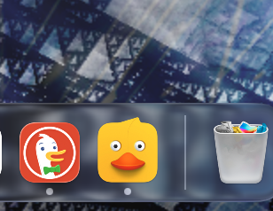
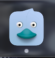

# Ducky 🦆

A tiny native macOS rubber duck debugger that lives in your Dock.


| Happy | Lonely |
|-------|--------|
|  |  |

## What it does

- **Quacks on its own** — random notifications every 5–15 minutes to remind you it exists
- **Quacks when you click it** — 1–3 quacks, more if you keep clicking
- **Goes feral if you really go at it** — 5+ rapid pats triggers a random bonus sound
- **Gets lonely** — after 10 minutes of neglect the Dock icon fades to blue-grey
- **Perks back up** — click a lonely duck and it chatters excitedly and flashes vivid yellow for 3 seconds
- **Silent Mode** — right-click the Dock icon to toggle all sounds and notifications off

## Requirements

- macOS 12+
- Python 3.11+ with a venv

## Build

```bash
python3 -m venv .venv && source .venv/bin/activate
pip install pyobjc-framework-Cocoa pyobjc-framework-Quartz py2app
python setup.py py2app
open dist/Ducky.app
```

On first launch macOS will ask for notification permission — grant it, or go to **System Settings → Notifications → Ducky** and enable Alerts.

## Adding more bonus sounds

Drop any `.mp3` files into `sounds/` and rebuild. They get picked up automatically and play randomly when your pat streak hits 5+.

## Project layout

```
ducky.py              app logic
setup.py              py2app bundle config
duck.png / duck.icns  app icon
quack.wav             normal quack (converted from source MP3)
quack_chatter.wav     fast chattery quack (1.6× speed, +15% pitch)
sounds/               bonus MP3s for high-streak petting
```
